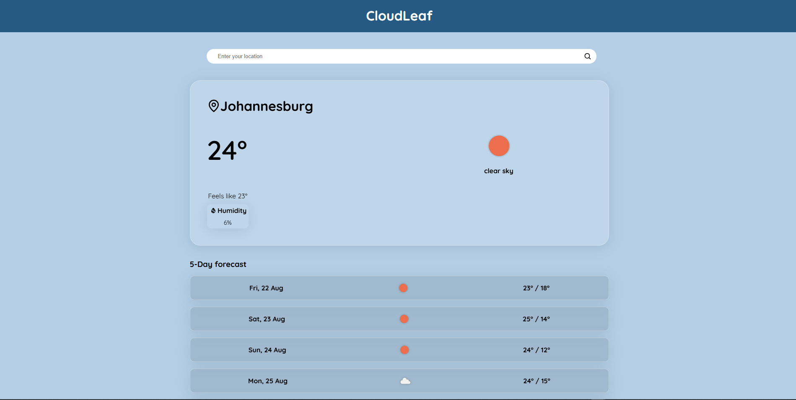

# Weather App

A simple, responsive weather application built with **React** that displays current weather and a 5-day forecast. Users can search for a city or use their current location to get weather information.

---

## Features

- Search for weather by **city name**
- Display **current weather**: temperature, description, icon, humidity, wind
- **5-day forecast** with min/max temperatures and daily weather icons
- Option to use **current location** for weather data
- Responsive layout, works on desktop and mobile
- Default city is shown if location is not granted
- Styled with **Vanilla CSS**

---

## Screenshots

  